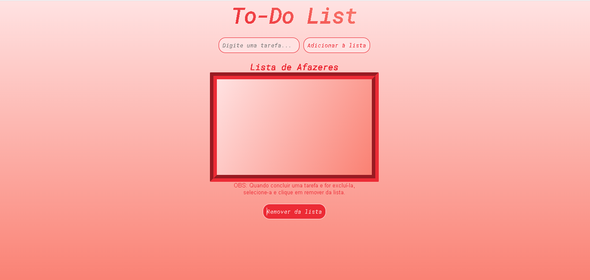

# To Do List 

Bom, esse projeto vi há algumas semanas no google e quis fazer. Seria um bom projeto para aumentar conhecimentos.
Quando comecei a ideia era de deixar dados salvos em localStorage e a pessoa sempre ter sua lista, a menos que exclua, quando sua tarefa tiver sido concluída. Não estava conseguindo fazer e enviei ao git para testar responsividade (envio o link para meus amigos e namorada e eles testam). Agora consegui arrumar o que não estava conseguindo e ficou muito show! Gostei demais!

#### E ficou assim...

## Link aplicação (hospedado no Netlify):

https://peaceful-morse-b4c152.netlify.app/